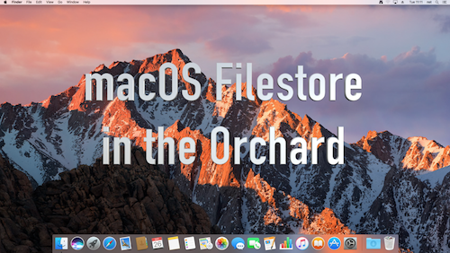
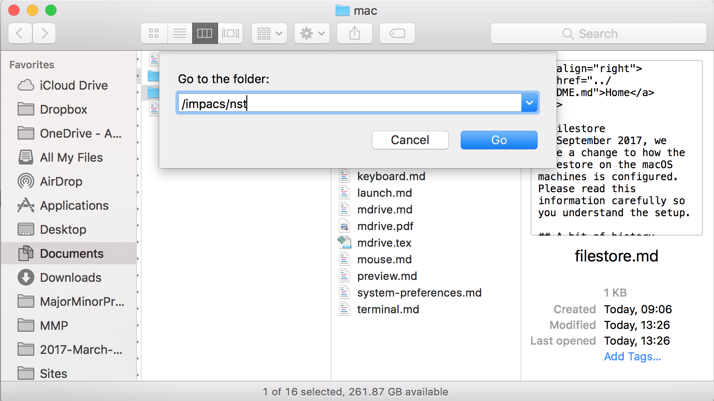

<a href="../README.md">Home</a>

# Filestore 
In September 2017, we made a change to how the filestore on the macOS machines is configured. Please read this information carefully so you understand the setup, **otherwise you may lose work**. 

## A bit of history
Before September 2017, we have setup the machines so that when you log in, your home filestore was mounted from a network disk.  Therefore, users did not store files locally on a machine. The advantage of this approach was that your files would be available to you on whichever machine you logged into in the room.

Unfortunately, the way that some applications are designed to run on macOS meant that this could create a lot of accesses to the network disk. That slowed down machines, affected the network and had a negative impact on the user experience. 

## Change in September 2017
In September 2017, we have changed the setup so that your default disk space is local to the machine that you are using. You still have access to your networked files on the IS and IMPACS servers (M: and P:)1. 

As part of this change, it is important to remember that you need to store your files on the Network filestore so that you can access it from other machines.

## Video to explain how to access your network files

A video is available to explain how to access your network filestore. This is on YouTube at [https://youtu.be/8LJsWctn8MU](https://youtu.be/8LJsWctn8MU). 

## Network filestore available

When you log in, you the following filestores are mounted. 

* `/aber/{username}` - your Information Services filestore, i.e. the M: drive
* `/impacs/{username}` - your IMPACS filestore, i.e. the P: drive
* `/dcs/{username}` - Staff in Computer Science can also access their Computer Science filestore. 

**Note** - replace `{username}` with your own username.

To access these, select Finder and do one of the following: 

* From the Finder menu, select Go > Go to folder...
* Press the Shift + Cmd + G keys on the keyboard. 

**Note** - The Cmd key is actually the Windows logo key on the black keyboards. 

A sheet is shown at the top of a Finder window, such as shown below.

 

Enter the path to the network filestore, remembering to enter your username.  Press OK and you will be shown the contents of that directory. 

See the video for tips on other ways to access the network filestore.

# Using Local filestore or Network filestore?

You can put files on the local filestore, e.g. in Documents or the Desktop, whilst you are using the machine. However, the files are only available on the machine. To make sure that you can access the files later on, after you have logged out, it is important that you copy the files to one of the network filestores. This is the same situation that you have on the Information Services PCs around Campus. 

After you log out, the files will remain on the local disk for a short while. So, if you forget to copy some files, go back to the machine as soon as possible, log in and copy your files to the network filestore. 

We cannot leave the local files on machines for too long otherwise there would not be space on the machines for lots of other people to log in. So, after a time, we will remove the local files on machines to prevent the machines from becoming full. For example, if you log back in on the same day, your local files will probably still be there. However, if you log in to the same machine the next day, we might have removed the local files. 

So, please remember to store files on the network file store so that you can access them again next time or from another machine.

1 For clarification: 

* M: is `\\smb1.aber.ac.uk\{username}`
* P: is `\\homefs.imaps.aber.ac.uk\{username}`

<a href="../README.md">Home</a>

