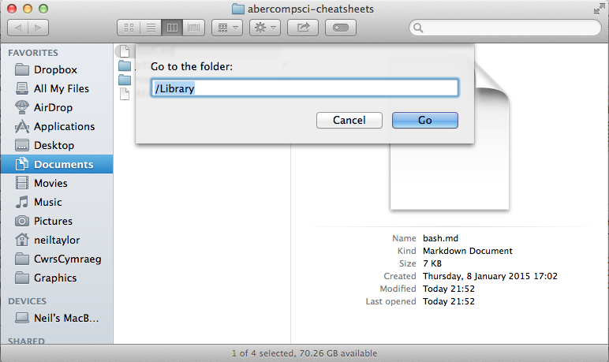
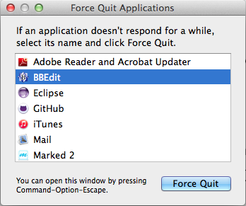

[Home](../README.md)

# Finder

The Finder application is active all of the time you are logged in. It is used to access and manage files as well as manage applications.  

This section will look at the file and application management features of Finder. 

## File Management 

### Finder windows 

#### Tabs 
It is possible to add tabs to a Finder window. To do that, select a Finder window and either press Cmd+t or select `File > New Tab` from the Finder menu bar.  

### Quick access to document in Finder
If an application window displays a document from the filestore, there is a handy way to find out where it is located in the Finder. Whilst this doesn't work in all windows, the general tip is that if the filename is displayed next to a mini-icon for the file, you can use this tip.

With the mouse pointer over the filename in the header bar, press the Cmd key and the (left) mouse button. A popup will be displayed, which shows the path from the file to the root of the filestore (in reverse order). You select any item on that popup list to quickly reveal the item (file or folder) within a new Finder window. 

### Viewing a specific folder
Some folders are hidden by default on OS X. You can quickly navigate to other parts of the filestore by entering the path into a Finder window. Either press the shortcut keys Shift+Cmd+G or select Go > Go to Folder... from the Finder menu. A sheet will drop down in the current menu, as shown below.  

 

Enter the file path and press Go (or the Return key) to display the contents of the folder.

## Application Management 

### The Dock 

### The Apple Menu 

### Stopping unresponsive applications (Force Quit)
If an application becomes unresponsive for a period of time, you can use Finder to terminate it. This is the visual equivalent of using the Unix kill command. To display the list of applications that can be closed, press the Cmd+Option+Esc key combination. A small window is displayed; an example is provided below. 

 

The above dialog shows that all applications appear to be active. If OS X thinks that an application is unresponsive, it will add a short description next to the application name. If the application doesn't have that extra description, give it a bit longer to see if it becomes responsive again. 

If you do need to stop the application, select the application from the list and press Force Quit. In most circumstances, that will stop the application. If the application refuses to quit, you might need to open the Activity Monitor application or open the Terminal to run kill. 

[Home](../README.md)

