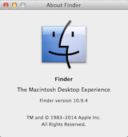

[Home](../README.md)

# Finder

The Finder application is active all of the time you are logged in. It is used to access and manage files as well as manage applications.  

This section will look at the file and application management features of Finder. 

## File Management 

## Application Management 

### The Dock 

### The Apple Menu 

[Home](../README.md)

