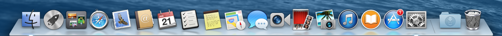
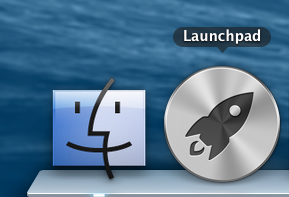
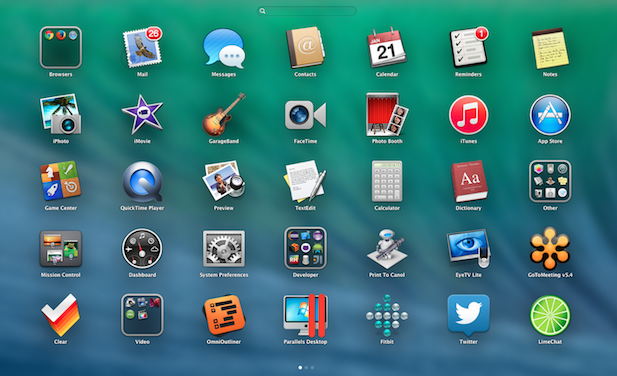
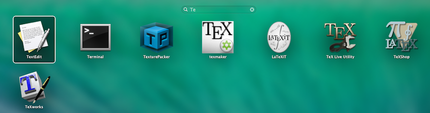

<a href="../README.md">Home</a>

# Launching Applications 

This section should talk about Launchpad and how to start applications from Spotlight and the Terminal (command line). 

## Launching from the Dock 
The Dock is shown at the bottom of the window, as shown below. 

  

If the application is on the dock, you can click it to start the application. If the application is already running, then it will be brought to the front.

## Launchpad 
Launchpad is used to start any GUI based applications, although it is particularly useful to launch applications that aren't shown in your Dock. You start the launchpad by clicking the icon on the Dock showing the spaceship. This is normally next to the Finder icon, as shown below. 

  
  
The screen will show a collection of application icons. Click on the application icon to start it. 

  

There is a search bar at the top, which can use to enter the name to find the application icon. The following screenshot shows a search for applications that contain the letters  **Te** in the name. 

  

There will normally be extra screens, indicated by the circles at the bottom. To view more icons, move the mouse so that it isn't over an icon and then click and drag the mouse left or right. This will drag the other screen of icons into view.  
  
To return to Finder, click on the background of the launchpad. 

## Spotlight 
Spotlight is used to search the machine. However, as part of the work to integrate the iMacs with the network file store, Spotlight indexing of files has been disabled. Therefore Spotlight search is less useful on this setup. However, the Spotlight feature for starting applications is still useful. 

To start the search feature, click on Cmd+Space. On El Capitan, the spotlight bar opens in the middle of the machine.  

Enter the name of the application you want to start. Normally, starting to type the name is enough. If the text matches the name of the application, it will be shown as the top-hit and highlighted. Press return to run the application. 
  
## Terminal 
You can also launch an application from the terminal, although this is less likely than the other two options. It is more likely that you might use the terminal to open a file within an application. 

This sub-section needs to be completed. 

<a href="../README.md">Home</a>

