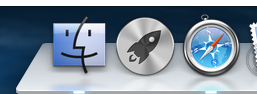
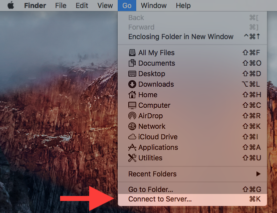
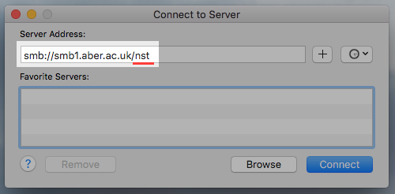

<a href="README.md">Home</a>

# Mounting a drive on Mac OS X
The iMac machines in the Orchard already have your Central IS filestore attached. Therefore, you do not need to mount the M: drive to the machine. However, if you need to mount a drive from a different machine, or indeed want to mount your IS filestore on your laptop, follow these instructions. 

## Mounting 
1. Open **Finder** by clicking on its icon on the far left of the
Dock, at the bottom of the screen

  
  
2. Open the **Go** menu at the top of the screen, and click **Connect
to Server**

  

3. To mount a case-sensitive version of your IS filestore, enter `smb://your_username@smb1.aber.ac.uk/cshome` and click **Connect**.
The contents of your `M:` drive should then appear

  

4. To access your directory later on, open Finder again and look for
`smb1.aber.ac.uk` in the sidebar

  

## Case Insensitive .. 
Note: you can use an alternative URL for accessing your IS filestore. It is `smb://smb1.aber.ac.uk/your_username`. However, this version is **not** case sensitive. 

<a href="README.md">Home</a>

