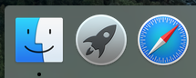

 

<a href="../README.md">Home</a>

# Mounting a drive on Mac OS X
The iMac machines in the Orchard are using filestore provided by IMPACS. This is mounted as `/impacs/your_userid` and is your default filestore when using the iMacs. 

The IMPACS filestore is different from your IS filestore; we sometimes refer to the IS filestore as M: drive.  You can still mount your IS filestore  if you need access to those files. 

To mount your IS filestore, or a drive from another file server, follow these instructions. 

## Mounting 
1. Open **Finder** by clicking on its icon on the far left of the
Dock, at the bottom of the screen.
 
  
  
2. Open the **Go** menu at the top of the screen, and click **Connect
to Server**, or press Cmd-k. 

  

3. To mount your IS filestore, M: drive, enter `smb://smb1.aber.ac.uk/your_userid` and click **Connect**.  For example, if the screenshot below, you would replace **nst** with your own AU user id.  

  
  
Press Connect and then enter your AU user id and password if prompted. 

The contents of your `M:` drive should then appear.

4. To access your directory later on, open Finder again and look for
`smb1` in the sidebar, as shown below. 

  
    
  
## Access from the command line
If you need to access the mounted filestore via the command line, look in /Volumes to find the directory where the filestore has been mounted. This is likely to be /Volumes/your_userid if this is the only extra drive you have mounted. 
  

<a href="../README.md">Home</a>

