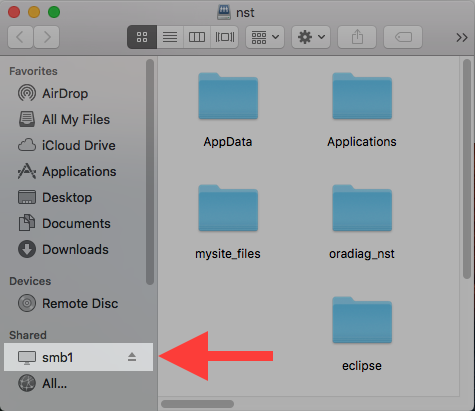

# Mounting a drive on Mac OSX.

1. Open **Finder** by clicking on its icon on the far left of the
Dock, at the bottom of the screen

  
2. Open the **Go** menu at the top of the screen, and click **Connect
to Server**

  
3. Enter `smb://smb1.aber.ac.uk/your_username` and click **Connect**.
The contents of your `M:` drive should then appear

  
4. To access your directory later on, open Finder again and look for
`smb1.aber.ac.uk` in the sidebar

  
