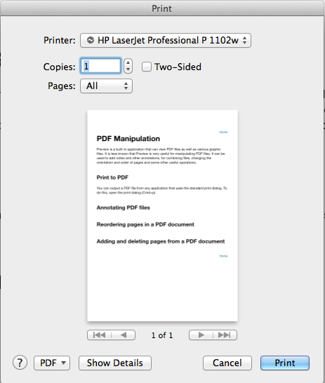
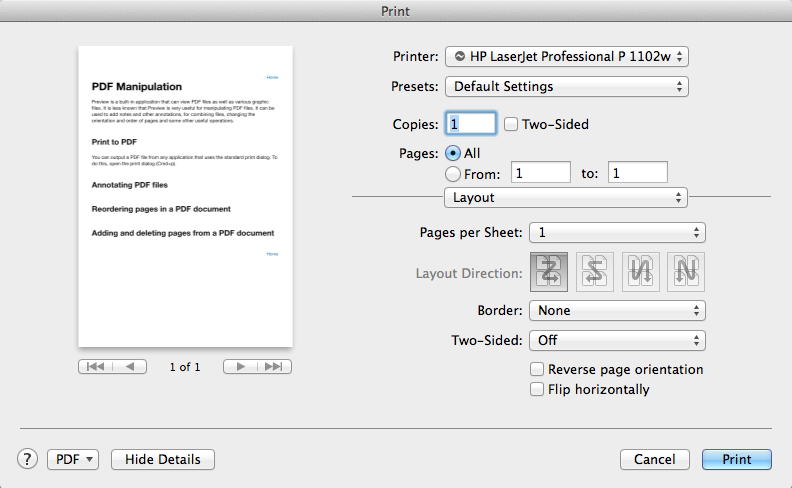
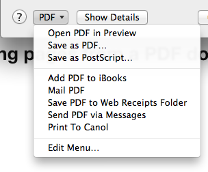

[Home](../README.md)

# PDF Manipulation

Preview is a built-in application that can view PDF files as well as various graphic files. It is less known that Preview is very useful for manipulating PDF files. It can be used to add notes and other annotations, for combining files, changing the orientation and order of pages and some other useful operations. 

## Print to PDF
You can output a PDF file from any application that uses the standard print dialog. To do this, open the print dialog (Cmd+p). A dialog similar to the following is shown. 

 

This is actually a condensed version. If you click Show Details, you will see an expanded version with more options. This can be handy if you want to print multiple pages to a single page.  

 

On the bottom left of the dialog, you will see the button PDF. Click this and a menu will be shown. 

 

Select `Save as PDF`. A file dialog will be shown to allow you to choose the filename and location.  For information about the save dialog, see [File and Print dialogs](file-and-print-dialogs.md).

## Annotating PDF files 

## Reordering pages in a PDF document 

## Adding and deleting pages from a PDF document 

[Home](../README.md)

